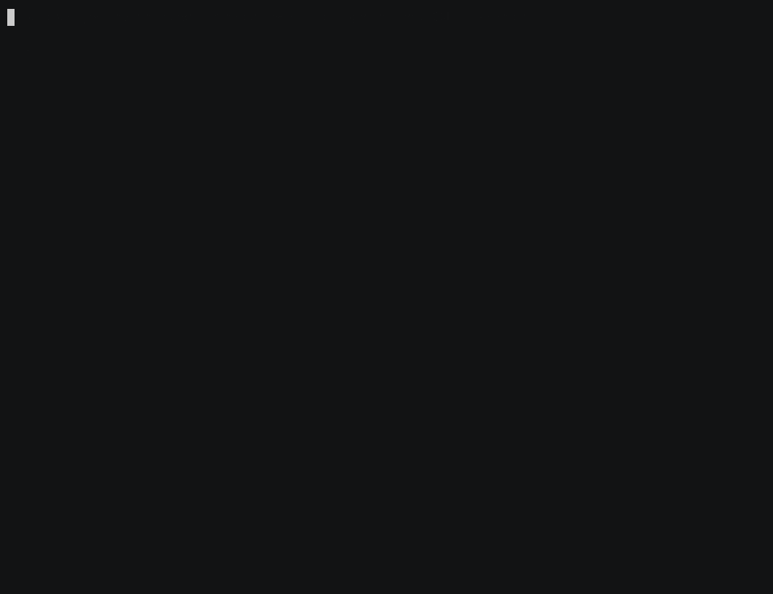

# duckdb-jev

Ask a question about every row of a table, in SQL, and get a real SQL type back.
A DuckDB extension over [Jev](https://typesafe.ai), TypeSafe's model for typed
answers instead of text.



## Why

The data you want to ask about already sits in a table or a Parquet file, and SQL is
the query language everyone has. So ask the question where the data is, instead of
pulling it out, wrapping an API in a script and writing the answer back.

Jev picks from a set you define instead of writing an answer you then check. The
result is typed by construction, not by validation, and not generating is what makes
it cheap enough to run on every row.

## Using it

```console
D CREATE SECRET (TYPE jev, API_KEY 'sk-...');
```

`ENDPOINT` and `MODEL` are optional. With no secret, queries fail when planned
rather than part-way through.

Each function takes the row's text, then a **criteria** literal. The criteria is
both the set of permitted answers and the column's type, so it must be constant.

| Call | Criteria | Column |
|---|---|---|
| `jev_choice(text, MAP{option: meaning})` | what each option means | `ENUM` of those options |
| `jev_score(text, [worst, ..., best])` | an ordered rubric | `DOUBLE` on that scale |
| `jev_noul(text, MAP{'true': …, 'false': …})` | what yes and no mean | `DOUBLE`, probability of yes |
| `jev_ask(text, {name: criteria, …})` | any mix | `STRUCT`, one field per question |

The descriptions are the only thing telling the model what an option means.

One request carries many questions, so ask them together. Each field takes its type
from its criteria; choice and score carry a `<name>_confidence` beside them.

```console
D WITH asked AS (
      SELECT id, jev_ask(body, {
          intent:   MAP{'refund': 'wants money back', 'bug': 'something broken',
                        'praise': 'a compliment'},
          severity: ['trivial', 'minor', 'normal', 'serious', 'critical'],
          urgent:   MAP{'true': 'needs a reply today', 'false': 'can wait'}
      }) AS a FROM tickets)
  SELECT id, a.intent, round(a.severity, 1) AS severity, round(a.urgent, 2) AS urgent
  FROM asked ORDER BY id;
┌───────┬─────────────────────────────────┬──────────┬────────┐
│  id   │             intent              │ severity │ urgent │
│ int32 │ enum('refund', 'bug', 'praise') │  double  │ double │
├───────┼─────────────────────────────────┼──────────┼────────┤
│     1 │ refund                          │      1.7 │   0.52 │
│     2 │ bug                             │      3.0 │   0.49 │
│     3 │ praise                          │      0.6 │   0.46 │
└───────┴─────────────────────────────────┴──────────┴────────┘
```

An empty option map, a duplicate option, a one-level rubric, over 255 options or a
non-constant criteria all fail when the query is planned, not on row 400,000.

### Cost

One request per row, so treat these like a join against a paid service. Rows in a
chunk go out sixteen at a time. Identical requests are cached for the life of the
process. DuckDB evaluates a function once per place it appears, so without that the
same call in `WHERE` and `SELECT` bills twice per row. Rate limits, server errors and
dropped connections retry with backoff; anything else fails at once.

```console
D SELECT * FROM jev_usage();
┌──────────┬────────────┬──────────────┬───────────────┐
│ requests │ cache_hits │ input_tokens │ output_tokens │
│  int64   │   int64    │    int64     │     int64     │
├──────────┼────────────┼──────────────┼───────────────┤
│        3 │          0 │         1163 │           208 │
└──────────┴────────────┴──────────────┴───────────────┘
```

`SET jev_on_error = 'null'` loses the row instead of the query.

## Licence

MIT
